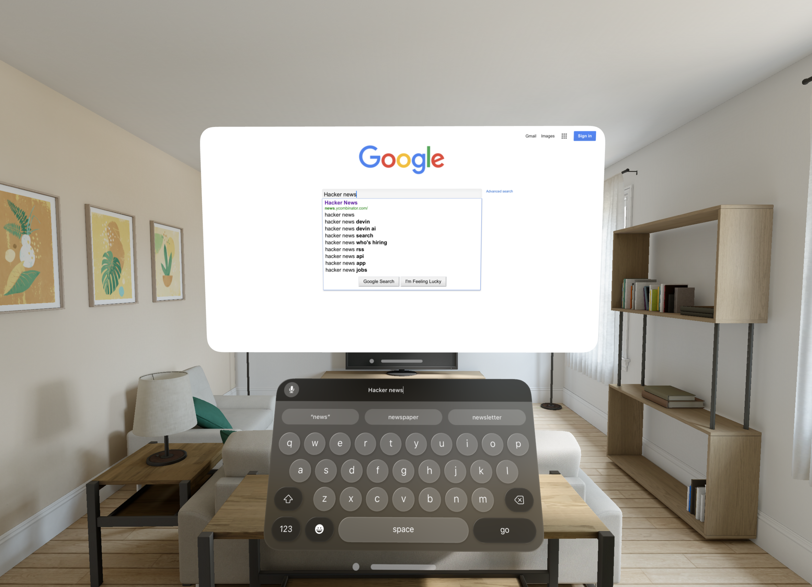

# visionOS Mixed Reality WebView Example

This Unity project demonstrates how to view and interact with web content in Mixed Reality on Apple Vision Pro using [Vuplex 3D WebView](https://developer.vuplex.com/webview/overview). All you need to do is import 3D WebView for visionOS into the project and then build the WindowedWebViewExample scene, which demonstrates how to use the [VisionOSWebView.CreateInWindow()](https://developer.vuplex.com/webview/VisionOSWebView#CreateInWindow) API to open a webview in a native visionOS (SwiftUI) window.

## Steps taken to create this project

1. Created a new project with Unity 2022.3.17 using the 3D URP project template.
2. Opened the Unity Package Manager and did the following:
    - Imported the com.unity.polyspatial.visionos package and its dependencies.
    - On the page for the com.unity.polyspatial package, clicked on the "Samples" tab and clicked "Import" button for "Unity PolySpatial Samples".
3. Made a copy of the Manipulation sample scene and named it [WindowedWebViewExample](./Assets/Scenes/WindowedWebViewExample.unity).
4. Added a [WindowedWebViewExample.cs](./Assets/Scripts/WindowedWebViewExample.cs) script that uses the [VisionOSWebView.CreateInWindow()](https://developer.vuplex.com/webview/VisionOSWebView#CreateInWindow) API to open a windowed webview.
5. Removed unneeded objects from the WindowedWebViewExample scene.
6. Updated the following project settings:
    - "XR Plug-in Management": enabled the "Apple visionOS" XR plugin
    - "XR Plug-in Management" -> "Apple visionOS": 
        - Changed the App Mode to "Mixed Reality"
        - Added values for "Hand Tracking Usage Description" and "World Sensing Usage Description"
    - Player Settings:
        - Disabled "Show Splash Screen"
        - Changed "Color Space" to "Linear"